<p align="center"></p>

# EMPA University Workshop

EMPA Workshop’a hoşgeldiniz, bu yazıda kartımız üzerinde bulunan sensörlerin nasıl kullanılacağı, MQTT Broker'a bağlanıp veri atmayı ve veri almayı ve NanoEdge AI Studio ile Yapay Zeka uygulamalarının nasıl kolayca mikrodenetleyiciyle gerçekleştirileceği anlatılacaktır. Lütfen önceki yazımızdaki ( EMPA Workshop’a gelmeden önce yapılacaklar) talimatlarını eksiksiz yaptığınızdan emin olunuz.

# Proje Dosyasının İçe Aktarılması ve Gerekli Kütüphanelerin Yüklenmesi

<br />
Kartımız üzerinde bulunan sensörler başlatılmak için kendilerine özel yazılmış kütüphanelere ihtiyaç duymaktadır. Bu kütüphaneler proje içerisine eklendikten sonra çeşitli komutlar yardımıyla sensör başlatma ve okuma işlemleri gerçekleştirilecektir.

Öncelikle bu [linkten](https://www.empa.com) uygulamalar için gerekli olan klasörleri indiriniz.

# Proje Dosyasının İçe Aktarılması

Öncelikle indirdiğiniz klasörün içerisinde bulunan Template_Workshop isimli klasörün içerisinde bulunan EMPA_WORKSHOP_YTU klasörünün içerisine girin. Burada bulunan .project uzantılı dosyaya çift tıklayarak projeyi STM32CubeIDE içerisine aktarın. Örnek bir klasör görünümü aşağıda verilmiştir.

<div align="center">
  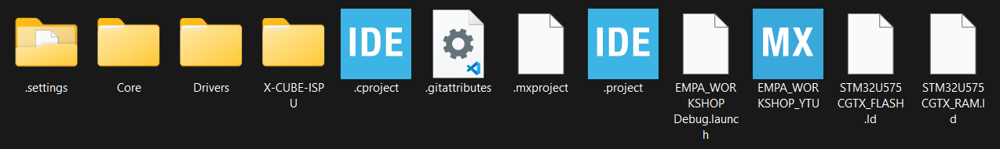
</div>
<br />


Bu işlemin ardından sizi STM32CubeIDE platformuna yönlendirecek ve projeyi IDE içerisine aktarmış olacaktır. Bunun için örnek görüntü aşağıda verilmiştir.

<div align="center">
  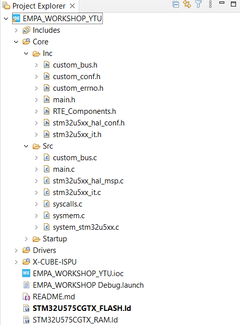
</div>
<br />

Ardından EMPA_WORKSHOP_YTU.ioc dosyasına çift tıklayarak proje konfigürasyon sayfasına ilerleyin. Açılan sayfada sol üstte bulunan “Device Configuration Tool Code Generation” butonuna tıklayarak proje dosyalarını güncelleyin.

# Kütüphane Dosyalarının Projeye Eklenmesi

Daha önceden indirmiş olduğunuz First Template klasörü içerisinde bulunan Libraries klasörü içerisine girin. Libraries->Inc içerisindeki dosyaları Core->Inc ve Libraries->Src içerisindeki dosyaları Core->Src içerisine atın. İşlem sonucunda proje dosyası aşağıdaki şekilde olacaktır.

<div align="center">
  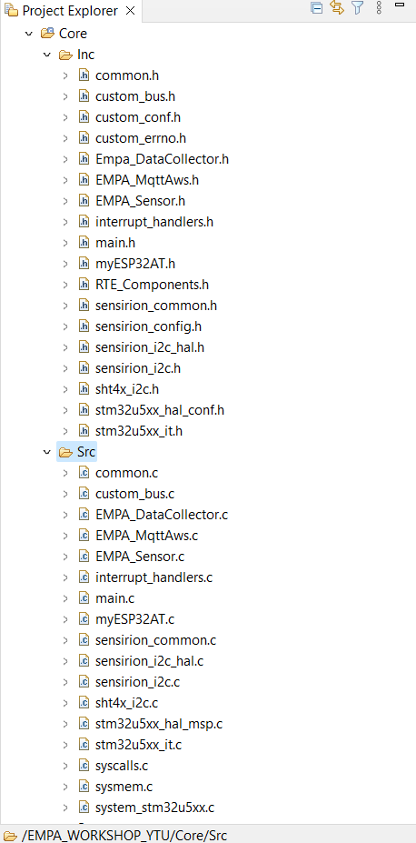
</div>
<br />


Bu aşamadan sonra main.c dosyasının içerisine girerek işlemlerimizi yürüteceğiz.

Öncelikle
```c
//  Library Include Start

//  Sensor Library Include End
```
satırları arasına 
```c
#include "EMPA_Sensor.h"
#include "EMPA_MqttAws.h"
#include "Empa_DataCollector.h"
```
yukaridaki kod satırını ekleyin. Bu satır sensörler için gerekli olan komutları içeren kütüphanenin proje içerisine aktarılmasını sağlar.

Öncelikle debug işlemlerini gerçekleştirebilmemiz için
```c
/* USER CODE BEGIN PFP */

/* USER CODE END PFP */
```
yorum satırları arasına 
```c
#ifdef __GNUC__
#define PUTCHAR_PROTOTYPE int __io_putchar(int ch)
#else
#define PUTCHAR_PROTOTYPE int fputc(int ch, FILE *f)
#endif

PUTCHAR_PROTOTYPE {
	HAL_UART_Transmit(&huart1, (uint8_t*) &ch, 1, HAL_MAX_DELAY);
	return ch;
}
```
yukarıdaki kod satırlarını ekleyin.

Ardından sensörlerimizin başlatılması için başlangıç fonksiyonunun main içerisinde eklenmesi gereklidir.

```c
//  Sensor Init Start

//  Sensor Init End
```
satırları arasına ``` EMPA_SensorInit(); ``` fonksiyonunu ekleyiniz.

Sonrasında 
```c
//  Sensor Section Start

//  Sensor Section End
```
satırları arasına ilerleyen aşamalarda implementasyonunu gerçekleştireceğimiz 
```c
	EMPA_SensorProcess();
	EMPA_SensorPrint();

```
fonksiyonlarını yerleştirin.

Bu fonksiyonların implementasyonu için öncelikle STM32CubeIDE içerisine önceki aşamalarda aktarmış olduğunuz EMPA_Sensor.c dosyası içerisine girin.

Ve ardından
```c
//SHT4X Start

//SHT4X End
``` 
yorum satırları arasına
 ```c
uint32_t sht4x_serialnumber;
int32_t temperature     = 0;
int32_t humidity 	= 0;

``` 
yukarıdaki kod satırlarını ekleyin.

Ve 
```c
//ISM330IS Start

//ISM330IS End
``` 
yorum satırları arasına 
```c
ISM330IS_Object_t ism330_obj_o;
ISM330IS_IO_t ism330_ctx;
uint8_t ism330_id;
ISM330IS_Capabilities_t ism330_cap;

imu_data imu_sensor_data;
```
yukarıdaki kod satırlarını ekleyin.

Sonrasında 
```c
//IMP34DT05 Start
//IMP34DT05 End
```
yorum satırları arasına
```c
#define AUDIO_BUFFER_SIZE 1024
int16_t audio_rx[AUDIO_BUFFER_SIZE];
uint8_t AUDIO_MODE = 0;
uint8_t audio_test = 0;
```
yukarıdaki kod satırlarını ekleyin. Böylece sensörler için değişken ve tanımlama işlemleri tamamlanmış olur.

Ardından EMPA_SensorInit() fonksiyonu içerisindeki 
```c
//  SHT4X Init Start

//  SHT4X Init End
```
yorum satırları arasına 

```c
	if (BSP_I2C1_Init() != HAL_OK)	                        return 1;
	if (sht4x_serial_number(&sht4x_serialnumber) == 1)	return 1;

```
yukarıdaki kod satırlarını ekleyin.
Sonrasında 
```c
//  ISM330IS  Init Start

//  ISM330IS  Init End
```
yorum satırları arasına 

```c
        ism330_ctx.BusType = ISM330IS_I2C_BUS;
	ism330_ctx.Address = ISM330IS_I2C_ADD_H;
	ism330_ctx.Init = BSP_I2C1_Init;
	ism330_ctx.DeInit = BSP_I2C1_DeInit;
	ism330_ctx.ReadReg = BSP_I2C1_ReadReg;
	ism330_ctx.WriteReg = BSP_I2C1_WriteReg;
	ism330_ctx.GetTick = BSP_GetTick;

	if (ISM330IS_RegisterBusIO(&ism330_obj_o, &ism330_ctx) != ISM330IS_OK)
		return 1;

	if (ISM330IS_ReadID(&ism330_obj_o, &ism330_id) != ISM330IS_OK)
		return 1;

	if (ism330_id != ISM330IS_ID)
		return 1;

	if (ISM330IS_Init(&ism330_obj_o) != ISM330IS_OK)
		return 1;

	if (ISM330IS_ACC_Enable(&ism330_obj_o) != ISM330IS_OK)
		return 1;

	if (ISM330IS_GYRO_Enable(&ism330_obj_o) != ISM330IS_OK)
		return 1;

	HAL_Delay(300);

```
yukarıdaki kod satırlarını ekleyin.

Ardından
```c
//IMP34DT05 Init Start

//IMP34DT05 Init End

```
yorum satırları arasına 
```c
	if (HAL_SAI_Receive_DMA(&hsai_BlockA1, (uint8_t*) audio_rx,
			AUDIO_BUFFER_SIZE) != HAL_OK) {
		return 1;
	}
	while (audio_test == 0) {
		if (AUDIO_MODE == 1) {
			AUDIO_MODE = 0;
			audio_test = 1;
		}
	}
#ifdef EMPA_DataCollector
	if(Flag_DataCollector == 0)
	{
		HAL_GPIO_WritePin(LED6_GPIO_Port, LED6_Pin, GPIO_PIN_SET);
		counter_state = sensor_mode;
		Flag_DataCollector = 1;
	}
#endif


```
yukarıdaki kod satırlarını ekleyin. EMPA_SensorInit() fonksiyonu için gerekli değişiklikler tamamlanmıştır.

EMPA_SensorProcess() fonksiyonu için gerekli değişikliklere başlayabilirsiniz. Öncelikle EMPA_SensorProcess() fonksiyonu içerisinde;
```c
// SHT40 Sensor Process Start
// SHT40 Sensor Process End
```
yorum satırları arasına 
```c
if(sht40_sensor_process(&temperature,&humidity) != HAL_OK)	return 1;
```
yukarıdaki kod satırını ekleyin.

Ardından 
```c
//ISM330IS Sensor Process Start
//ISM330IS Sensor Process End

```
yorum satırları arasına 
```c
if(ism330_sensor_process(&imu_sensor_data) != HAL_OK) return 1;
```
yukarıdaki kod satırını ekleyin.

Ardından 
```c
	//IMP34DT05 Sensor Process Start

	//IMP34DT05 Sensor Process End

```
yorum satırları arasına 
```c
if(imp34_sensor_process() != HAL_OK) return 1;
```
yukarıdaki kod satırı eklenir. Ve EMPA_SensorProcess fonksiyonu için gerekli değişiklikler tamamlanmış olur.

Ardından EMPA_SensorPrint() fonksiyonu için gerekli değişikliklere geçebilirsiniz.
Öncelikle EMPA_SensorPrint() fonksiyonu içerisindeki 
```c
    //Print Start

    //Print End
```
yorum satırları arasına 
```c
    printf("\e[1;1H\e[2J");
```
yukarıdaki kod satırını ekleyin. Böylece terminal programı içerisinde son yazılan debug mesajlarının sürekli olarak temizlenmesi sağlanır.

Ardından 
```c
	//SHT40 Print Start

	//SHT40 Print End
```
yorum satırları arasına 

```c
	printf("\nTemperature : %0.2f C Humidity : %0.2f\r\n",
			temperature / 1000.0f, humidity / 1000.0f);
```
yukarıdaki komut satırını ekleyin.

Ardından 
```c
	//ISM330IS Print Start

	//ISM330IS Print End
```
yorum satırları arasına 
```c
	printf("\nACC X: %ld  ACC Y: %ld ACC Z: %ld\r\n", imu_sensor_data.acc.x,
			imu_sensor_data.acc.y, imu_sensor_data.acc.z);
	printf("\nGYRO X: %ld  GYRO Y: %ld GYRO Z: %ld\r\n", imu_sensor_data.gyro.x,
			imu_sensor_data.gyro.y, imu_sensor_data.gyro.z);
```
yukarıdaki kod satırlarını ekleyin.

Ardından 
```c
	//IMP34DT05 Print Start

	//IMP34DT05 Print End
```
yorum satırları arasına 
```c
	printf("\r\n");
	for (int i = 0; i < AUDIO_BUFFER_SIZE; i++) {
		printf("%d ", audio_rx[i]);
	}
```
yukarıdaki kod satırlarını ekleyin.

Böylece EMPA_Sensor.c dosyası içerisindeki gerekli değişiklikler tamamlanmış olur.

Terminal üzerinden yazdırma işlemlerini gerçekleştirirken float değişkenlerin yazdırılabilmesi için proje ayarlarından "Use float with printf from newlib-nano (-u _print_float)  seçeneğinin seçilmesi gerekir.
<div align="center">
  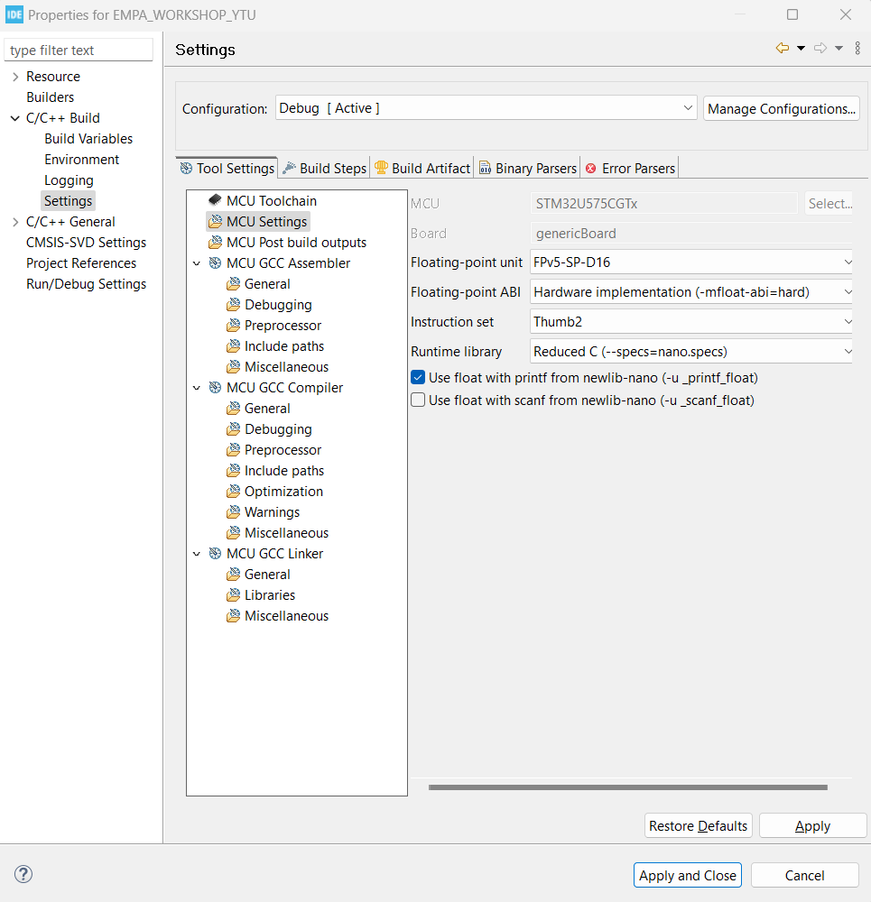
</div>
<br />
Bunu da yukarıdaki resimde gözüktüğü üzere Projeye sağ tıklayarak en altta bulunan Properties seçeneğini seçtikten sonra C/C++ Build->Settings->MCU Settings kısmından gerçekleştirebilirsiniz.
 

İlk uygulamamız böylece tamamlanmış olur. Uygulamamızda main.c içerisinde while(1) kısmında EMPA_SensorProcess() ve EMPA_SensorPrint() fonksiyonlarını eklemiş olduğumuz için artık uygulamamız çalışmaya hazır hale getirilmiştir. 

Sol taraftaki proje dosyasına sağ tıklayarak Build Project seçeneğine tıklayarak dosya derlenebilir. Aşağıdaki şekilde de gösterilmiştir.


# DATA COLLECTOR UYGULAMASI

Ardından, sıradaki uygulamamız olan NanoEdge AI Studio için verileri UART üzerinden gönderme işlemine geçebiliriz.

Öncelikle common.h dosyası içerisinde 

```#define EMPA_MqttAws``` satırını Ctrl + 7 tuş kombinasyonu ile yorum satırını haline getirin.

Ardından ```#define EMPA_DataCollector``` satırını yorum satırından çıkaralım. Bunun için Ctrl + 7 tuş kombinasyonu ya da metni seçip sağ tıklayarak Source->Toggle Comment seçeneğini seçebilirsiniz. Yaptığımız değişikliklerin geçerli olabilmesi için dosyayı kaydetmemiz gerekmektedir.

Ardından main.c içerisinde 
```c
//  Private Variables Start

//  Private Variables End
```
yorum satırları arasına 
```c

#ifdef EMPA_DataCollector
uint8_t Flag_DataCollector = 0;
#endif

```
yerleştirilir.
Ve ardından daha önceki uygulamamızda eklemiş olduğumuz 


```c
 	EMPA_SensorProcess();
	EMPA_SensorPrint();
 ```
  fonksiyonlarını seçip yorum satırı haline getirin ya da tamamen silin.

Ardından 
```c
//	Data Collector Progress Start

//	Data Collector Progress End
```
yorum satırı arasına 
```c
EMPA_DataCollectorProcess();
 ```
  fonksiyonunu ekleyin.

Bu aşamada, uygulamamız çalışmaya hazır hale gelmiştir. Kartımızın üzerindeki göz kısmında bulunan LED'in yandığını gözlemleyeceksiniz. Ayrıca, burun kısmındaki buton ile farklı LED'lerin yandığını görebilirsiniz. <br />

Kartın en üstündeki LED'den başlayarak aşağıya doğru sırasıyla İvmeölçer, Jiroskop ve İvmeölçer + Jiroskop verilerini seri porttan gönderen bir uygulama oluşturulmuştur. İstenilen durumu seçip, butona 3-4 saniye boyunca basılı tuttuğunuzda, ilgili durumun LED'i yanıp sönerek seçildiğini gösterecek ve veri seri porttan gönderilecektir. Bu durumu terminal üzerinden gözlemleyebilirsiniz.<br />

Bu uygulamanın amacı, toplanan veriler ile dataset oluşturmaktır. Buradan sonra elimizdeki dataset ile ne yapılabileceği anlatılacaktır.

# MQTT UYGULAMASI

Bir sonraki uygulamamızda, ESP32-C3-MINI geliştirme kartını kullanarak MQTT protokolü ile iletişim kuracağız. AT komutları aracılığıyla sıcaklık ve nem verilerini MQTT Broker'a ileteceğiz.

# ESP32 MQTT Kurulumu

Örneğimizde ESP32-C3 modülümüzü wifi modülü olarak kullanacağız. Bunun için AT firmware'i ESP32-C3'ün flash'ına kaydetmemiz gerekiyor (Biz sizin için kaydettik :blush: Kendiniz de yapmak isterseniz bu [rehberi](https://docs.espressif.com/projects/esp-at/en/latest/esp32c3/Get_Started/index.html) kullanabilirsiniz.)

MQTT bağlantısı için ESP32'yi internete bağlayıp sonrasında MQTT bağlantısını gerçekleştirmemiz gerekiyor. Bunun için aşağıdaki komutları gönderip dönüşlerinin başarılı olup olmadığını kontrol etmemiz gerekiyor.

##### Gerekli AT Komutları 

* Komut: ```AT+RST```
:arrow_right_hook: ```OK```
Tanım: Modülü Yeniden Başlatır
<br />

* Komut: ```AT+CWMODE=1```
:arrow_right_hook: ```OK```
Tanım: Wi-Fi modunu ayarlayın (İstasyon/SoftAP/İstasyon+SoftAP).
<br />

* Komut: ```AT+CWJAP="EMPA_Guest",Gst@Emp2023!!```
:arrow_right_hook: ```WIFI CONNECTED WIFI GOT IP OK ```
Tanım: Wifi'ya bağlanın.
<br />

* Komut: ```AT+CIPSNTPCFG=1,3,"pool.ntp.org"```
:arrow_right_hook: ```OK```
Tanım: Saat dilimini ve SNTP sunucusunu sorgulayın/ayarlayın.
<br />

* Komut: ```AT+CIPSNTPTIME?```
:arrow_right_hook: ```+CIPSNTPTIME:Tue May 14 14:22:33 2024 OK```
Tanım: SNTP zamanını sorgulayın.
<br />

* Komut: ```AT+MQTTUSERCFG=0,2,"","","",0,0,""```
:arrow_right_hook: ```OK ```
Tanım: MQTT kullanıcı yapılandırmasını ayarlayın
<br />

* Komut: ```AT+MQTTCONN=0,"a29nabc30lu54k-ats.iot.us-east-1.amazonaws.com",8883,1```
:arrow_right_hook: ```+MQTTCONNECTED:0,5,"a29nabc30lu54k-ats.iot.eu-west-1.amazonaws.com","8883","",1 ```
Tanım: MQTT Brokerlarına bağlanın
<br />

* Komut: ```AT+MQTTCONN?```
:arrow_right_hook: ```+MQTTCONN:0,4,5,"a29nabc30lu54k-ats.iot.eu-west-1.amazonaws.com","8883","",1 ```
Tanım: ESP32'nin bağlı olduğu MQTT aracısını sorgulayın
<br />

* Komut: ```AT+MQTTSUB=0,"EMPA_SUB",1```
:arrow_right_hook: ```OK ```
Tanım: MQTT konularına abone olun
<br />

* Komut: ```AT+MQTTPUBRAW=0,"EMPA_PUB",4,0,0```
:arrow_right_hook: ```OK >```
Cevap komutundan sonra gönderilecek data: ```"data"```
:arrow_right_hook: ```+MQTTPUB:OK```
Tanım:Uzun MQTT mesajlarını yayınlayın

##### Not : 
Bütün AT komutlarına bu [link](https://docs.espressif.com/projects/esp-at/en/latest/esp32c3/AT_Command_Set/index.html) üzerinden bakabilirsiniz.

<br />

##### Konfigürasyonların Kod İçinde Yapılması
Proje klasörü içindeki app_esp32_mqtt_aws.c dosyasında bulunan mqttConfig struct'ını kendi ayarlarınıza göre güncelleyiniz. 

```
/***********START Configurations************/
MQTT_Config mqttConfig = {
    .mqttPacketBuffer = mqttPacketBuffer,
    .mode_wifi = STATION_MODE,
    .OSC_enable = SC_DISABLE,
    .wifiID = "mywifi",
    .wifiPassword = "mypassword!!",
    .timezone = 3,
    .mode_mqtt = MQTT_TLS_1,
    .clientID = "",
    .username = "myusername",
    .mqttPassword = "mypassword",
    .keepAlive = 300,
    .cleanSession = CLS_1,
    .qos = QOS_0,
    .retain = RTN_0,
    .brokerAddress = "70a79e332abc4fd2a972c9fccbdedb79.s1.eu.hivemq.cloud",
    .reconnect = 0,
    .subtopic = "",
	.pubtopic = ""
};
/***********END Configurations************/
```
<br />

Uygulamamız için değiştirmeniz gereken yerler:
```
    .wifiID = "mywifi",
    .wifiPassword = "mypassword!!",
    .username = "myusername",
    .mqttPassword = "mypassword",
    .brokerAddress = "70a79e332abc4fd2a972c9fccbdedb79.s1.eu.hivemq.cloud",
	.subtopic = "",
	.pubtopic = ""
```


Bu işlemi gerçekleştirmek için öncelikle common.h dosyasında bulunan<br /> ```//#define EMPA_MqttAws``` satırının yorum işaretini kaldırmamız gerekmektedir. Bunun için şu adımları izleyin:

common.h dosyasını açın.
//#define EMPA_MqttAws satırına gidin.
Bu satırın başındaki yorum işaretini kaldırmak için Ctrl + 7 tuş kombinasyonunu kullanın.
Yaptığınız değişiklikleri kaydetmek için Ctrl + S tuş kombinasyonunu kullanın. Aşağıda değiştirilecek yer gösterilmiştir.

<div align="center">
  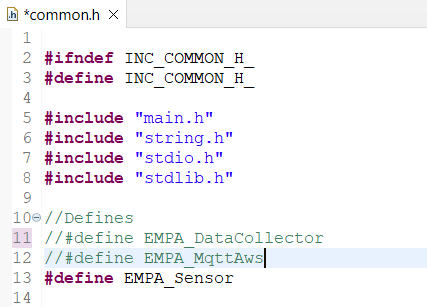
</div>
<br />

Ardından main.c içerisinde 
```c
//  Private Variables Start

//  Private Variables End
```
yorum satırları arasına
```c
#ifdef EMPA_MqttAws
char DEVICE_ID[] = "";
#endif
```
satırları eklenir ve DEVICE_ID içerisine kullanıcı adı yazılır.

Önceki uygulamamızda eklemiş olduğumuz 
```c
EMPA_DataCollectorProcess();
```
satırını seçip Ctrl + 7 tuş kombinasyonuyla yorum satırı haline getirin ya da tamamen silin.

Ardından 
```c
//  MQTT Section Start

//  MQTT Section End
```
yorum satırları arasına  ``` MY_MqttAwsProcess(); ``` fonksiyonu eklenir.

Ve böylece kodumuz tamamlanmış olur. Kodumuzu derleyip kart içerisine gömebilirsiniz. 
MQTT bağlantısı tamamlandığında, kartımızın üzerindeki LED'in yandığını göreceksiniz. Ayrıca, MQTT üzerinden HiveMQ'ya bir mesaj gönderdiğimizde veya bir mesaj aldığımızda, LED'ler bu durumu gösterecek şekilde yanacaktır. Bu sayede, LED'ler aracılığıyla bağlantı ve mesaj durumlarından haberdar olmanız sağlanacaktır.

# CubeAI ile Oluştulan Modelin Cihazda Testi
Bu bölümde devam ettiğimiz projeye bir ara verip CubeAI için ayrı bir proje açacağız. Bunun için tekrardan size vermiş olduğumuz ioc dosyası ile proje oluşturabiliriz.


# NanoEdge AI Studio Çıktılarının Koda Eklenmesi

Öncelikle NanoEdge AI Studio uygulamamız için yeni bir proje açacağız. Bunu da STM32CubeIDE içerisinde File->New->STM32 Project from an Existing STM32CubeMX Configuration File (.ioc)'a tıklayın. 
<div align="center">
  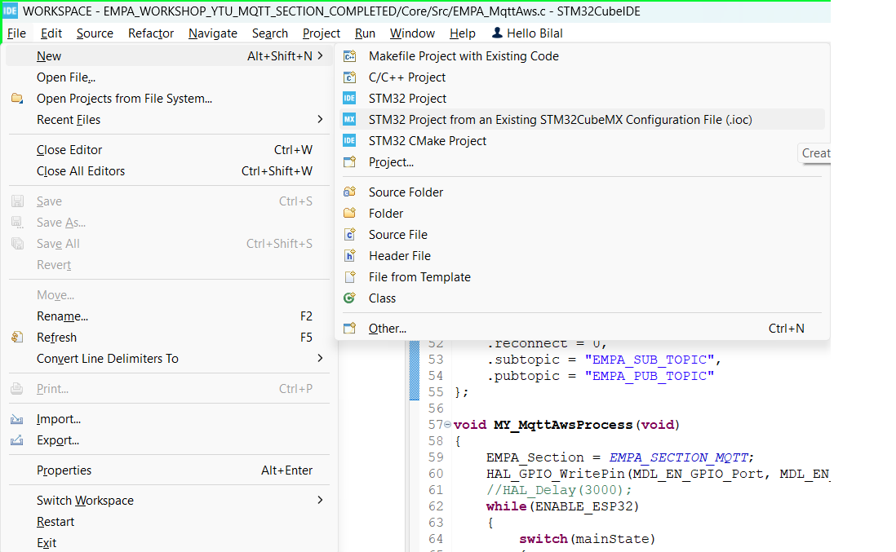
</div>
<br />

Ve ardından aşağıda gözüktüğü üzere indirmiş olduğunuz klasördeki EMPA_WORKSHOP_YTU.ioc dosyasını seçin ve ilerleyerek işlemi tamamlayın. 
<div align="center">
  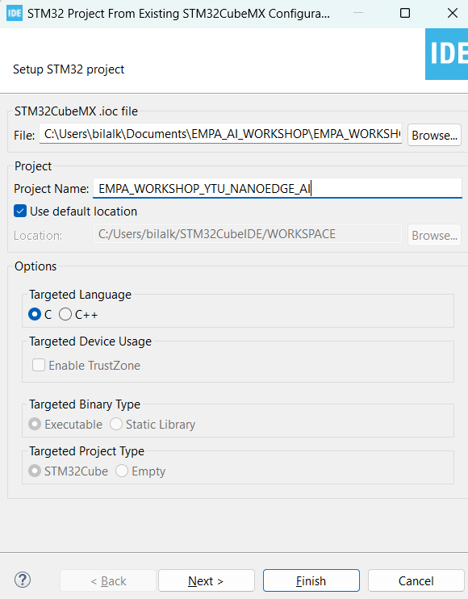
</div>
<br />
Burada .ioc dosyası içerisinde herhangi bir değişikllik yapmamıza gerek yoktur.

Ve ardından STM32CubeIDE programı içerisinde main.c dosyasına geçilir.<br />
<br />
Burada AI modelinin koda eklenmesinden önce anlık olarak sensör verilerini elde etmek için ISM330IS'ten verileri alabilmemiz gerekir. Bunun için sensor_process fonksiyonlarını eklememiz gerekir.<br />

Öncelikle 
```c
/* USER CODE BEGIN Includes */

/* USER CODE END Includes */
```
yorum satırları arasına 
```c
#include "ism330is.h"
#include "custom_bus.h"
```
yukarıdaki kütüphaneler eklenir.

Ardından 
```c
/* USER CODE BEGIN PV */

/* USER CODE END PV */
```
yorum satırları arasına 
```c
ISM330IS_Object_t ism330_obj_o;
ISM330IS_IO_t ism330_ctx;
uint8_t ism330_id;
ISM330IS_Capabilities_t ism330_cap;

typedef struct {
	int32_t x;
	int32_t y;
	int32_t z;
} acc;

typedef struct {
	int32_t x;
	int32_t y;
	int32_t z;
} gyro;

typedef struct {
	acc acc;
	gyro gyro;
} imu_data;
imu_data imu_sensor_data;
```
yukarıdaki kod satırları eklenir.

Sonrasında 
```c
/* USER CODE BEGIN PFP */

/* USER CODE END PFP */ 
```
yukarıdaki yorum satırları arasına 
```c
#ifdef __GNUC__
#define PUTCHAR_PROTOTYPE int __io_putchar(int ch)
#else
#define PUTCHAR_PROTOTYPE int fputc(int ch, FILE *f)
#endif

PUTCHAR_PROTOTYPE {
	HAL_UART_Transmit(&huart1, (uint8_t*) &ch, 1, HAL_MAX_DELAY);
	return ch;
}
uint8_t ism330_sensor_init(void);
uint8_t ism330_sensor_process(imu_data *sensor_data);
```
yukarıdaki kod satırları eklenir.

Ve 
```c
	/* USER CODE BEGIN 2 */

	/* USER CODE END 2 */
```
yukarıdaki yorum satırları arasına 
  ```c
  ism330_sensor_init();
  ``` 
  fonksiyonu eklenir. Böylece sensörden veri alabilecek seviyeye gelmiş oluruz.

  Float değişkenlerin yazdırılabilmesi için proje ayarlarından "Use float with printf from newlib-nano (-u _print_float)  seçeneğinin seçilmesi gerekir.
  <div align="center">
  
</div>
<br />

  Bunu da yukarıdaki resimde gözüktüğü üzere Projeye sağ tıklayarak en altta bulunan Properties seçeneğini seçtikten sonra C/C++ Build->Settings->MCU Settings kısmından gerçekleştirebilirsiniz.


NanoEdge AI Studio ile hazırlanan .a ve .h dosya uzantılı model dosyalarının koda eklenmesi için öncelikle knowledge.h ve NanoEdgeAI.h dosyalarının Core->Inc klasörüne eklenmesi gereklidir.
Ardından libneai.a dosyasını da Core->Src klasörüne kopyalamamız gereklidir. 

Dosyalar aşağıdaki gibi eklenmiştir. 
<div align="center">
  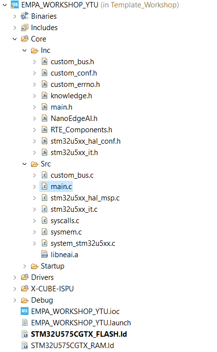
</div>
<br />

Öncelikle 
<div align="center">
  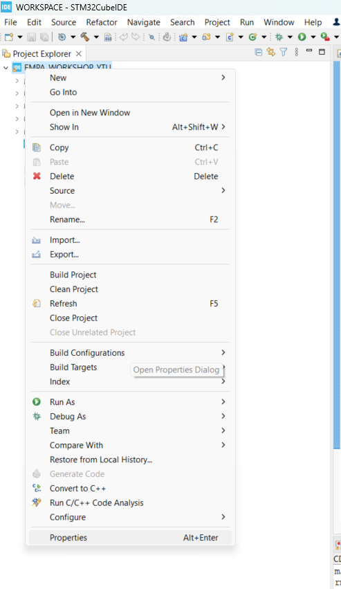
</div>
<br />
yukarıdaki şekilde gösterildiği üzere proje dosyasına sağ tıklanır ve en alttaki Properties seçilir.

Ardından C/C++ Build sekmesinden Settings seçilir. 

<div align="center">
  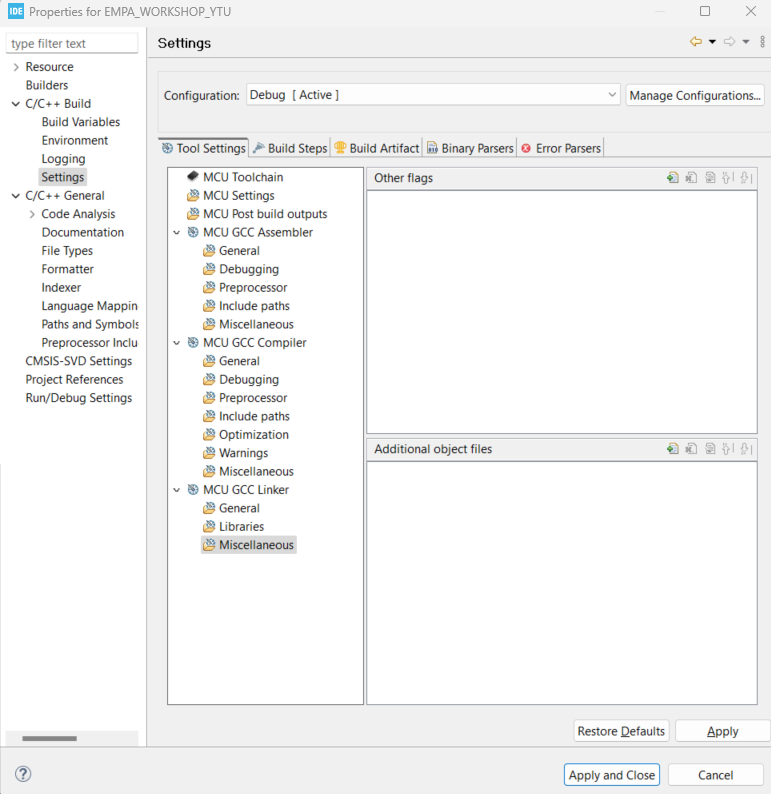
</div>
<br />
Ve yukarıdaki şekildeki gibi Tool Settings sekmesi altında MCU GCC Linker bölümünden Miscellaneous sekmesine girilir.
Burada Additional object files bölümünün yanındaki Add işaretine tıklanır. 

<div align="center">
  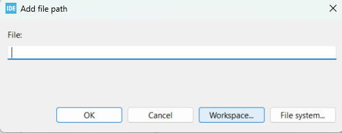
</div>
<br />
Açılan ekranda Workspace... seçeneği seçilir.


<div align="center">
  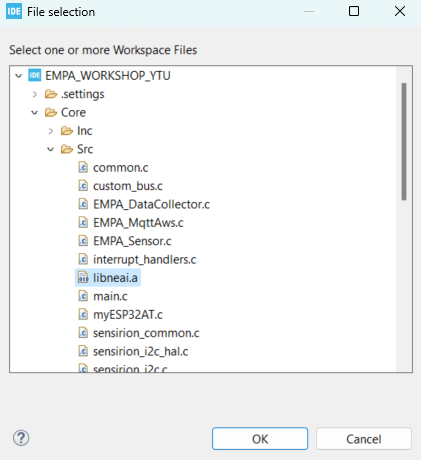
</div>
<br />
Ardından yukarıdaki şekildeki gözüken şekilde libneai.a dosyası seçilir.

Ok, Ok ve Apply and Close seçilir ve ekleme işlemi tamamlanmış olur. 

Ardından 

```c
/* USER CODE BEGIN Includes */

/* USER CODE END Includes */
```
yorum satırları arasına 
```c
#include "knowledge.h"
#include "NanoEdgeAI.h"
```
yukarıdaki kütüphaneler eklenir.


```c

Ve ardından 
/* USER CODE BEGIN PV */

/* USER CODE END PV */
```
yorum satırları arasına 

```c
uint16_t id_class = 0; // Sınıf kimliğini tutar
float input_user_buffer[DATA_INPUT_USER * AXIS_NUMBER]; // Giriş sinyalleri tamponu
float output_class_buffer[CLASS_NUMBER]; // Sınıf olasılıkları tamponu
const char *id2class[CLASS_NUMBER + 1] = { // Sınıf kimliğini sınıf adlarına eşler
    "unknown",
    "data_yurume",
    "data_kosma",
    "data_durma",
};
```
yukarıdaki kod satırlarını ekleyin.
Ardından  
```c
 /* USER CODE BEGIN 2 */

  /* USER CODE END 2 */
```
yorum satırlarının arasına 
```c
    enum neai_state state = neai_classification_init(knowledge);
    if (state != NEAI_OK) {
        printf("Initialization failed with error code: %d\n", state);
        return -1;
    }
```
yukarıdaki kod satırlarını ekleyin. <br />

Ve ardından while(1) içerisinde 
```c
	    for (int i = 0; i < DATA_INPUT_USER ; i++) {
	    	ism330_sensor_process(&imu_sensor_data);
	        input_user_buffer[AXIS_NUMBER*i] = (float)imu_sensor_data.acc.x; 
	        input_user_buffer[AXIS_NUMBER*i+1] = (float)imu_sensor_data.acc.y;
	        input_user_buffer[AXIS_NUMBER*i+2] = (float)imu_sensor_data.acc.z;
	        input_user_buffer[AXIS_NUMBER*i+3] = (float)imu_sensor_data.gyro.x;
	        input_user_buffer[AXIS_NUMBER*i+4] = (float)imu_sensor_data.gyro.y;
	        input_user_buffer[AXIS_NUMBER*i+5] =(float) imu_sensor_data.gyro.z;
	        HAL_Delay(8);
	    }
	    // Sinyal sınıflandırma işlemi
		state = neai_classification(input_user_buffer, output_class_buffer,
				&id_class);

		if (state == NEAI_OK) {
			printf("Classified as: %s\n", id2class[id_class]);
			
			printf("Class probabilities:\n");
			for (int i = 0; i < CLASS_NUMBER; i++) {
				printf("Class %s: %.2f%%\n", id2class[i + 1],
						output_class_buffer[i] * 100);
				HAL_Delay(300);
			}
		} else {
			printf("Classification failed with error code: %d\n", state);
		}
```
yukarıdaki kod satırlarını ekleyin. Yukarıdaki kod satırlarıyla beraber anlık olarak ivmeölçer ve jiroskop verileriyle durma, yürüme ve koşma aktivitelerinin sınıflandırılması gerçekleştirilip seri terminal aracılığıyla sınıflandırma sonucu gözlemlenecektir.
Ay

Örnek olarak aşağıda terminaldeki sınıflandırma sonuçlarını gözlemleyebilirsiniz.
<div align="center">
  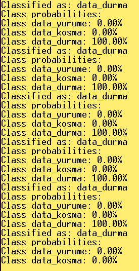
</div>
<br />


