# EMPA_WORKSHOP
 
 Demomuz içerisinde kullandığımız Pinleri ve Haberleşme protokollerinin nasıl yapılandırıldığını anlatarak başlıyoruz. 

  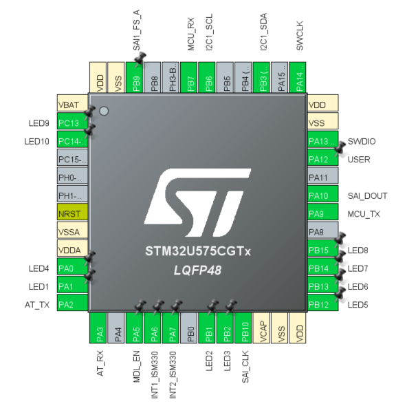

 

Demomuzda öncelikle .ioc dosyasında gerekli ledler için çıkışlar, SHT40 (sıcaklık ve nem sensörü) ve ISM330ISN (ivmeölçer-jiroskop) ile haberleşmek için I2C haberleşme kanalı, IMP34DT05 (mikrofon) için SAI (Serial Audio Interface) arayüzü, Debug işlemleri ve ESP32-C3-MINI-1 ile haberleşmek için UART arayüzü için ayarlamalar yapılır.

  

 

SHT40 (sıcaklık ve nem sensörü) ve ISM330ISN (ivmeölçer-jiroskop) ile haberleşmek için I2C haberleşme protokolü kullanılmaktadır.
Öncelikle Connectivity kısmından I2C1’i seçilmektedir. Mode penceresinde I2C‘yi seçilip aktif hale getirilmektedir. Parameter Settings kısmından I2C speed Mode‘unu Fast Mode (400 KHz) olarak seçilmektedir. Bu sistemde PB3 ve PB6 pinleri I2C olarak seçilmiştir.

  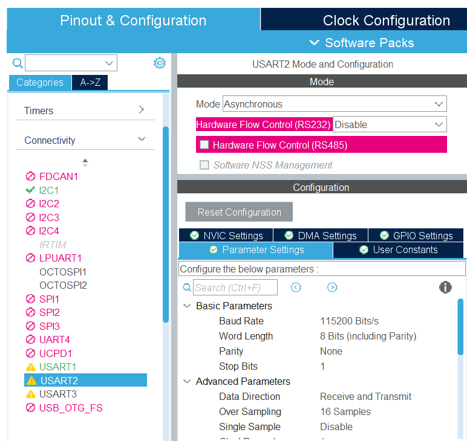

 

STM32 ile ESP32 arasındaki UART bağlantısını kurmak için USART2 seçeneğinin aktif hale getirilmesi gerekmektedir. Connectivity altında USART2 seçeneğini seçip Mode olarak Asynchronous modu seçilmiştir. Baud Rate seçeneğini 115200 olarak belirlenmiştir. Pinout View kısmında PA2 ve PA3 pinlerini AT_TX ve AT_RX olarak seçilmiştir. 

  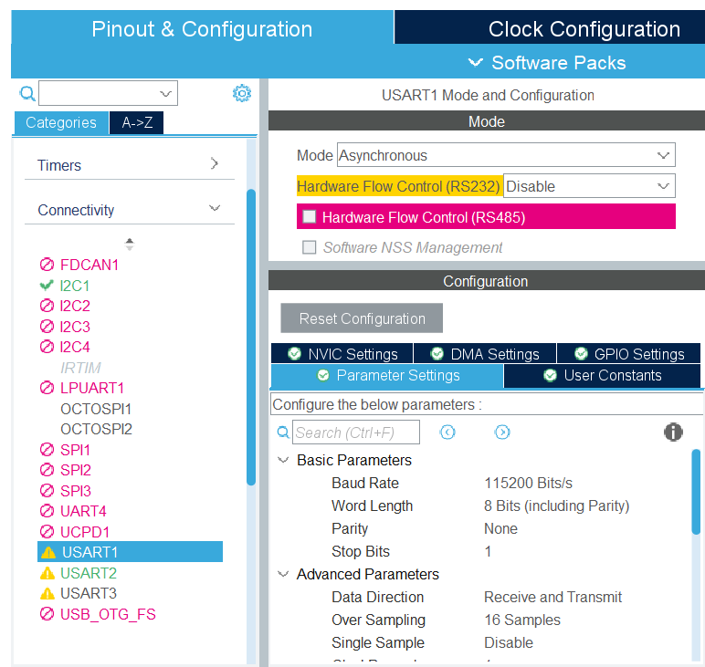

 

STM32 ile sensörlerimizden aldığımız verileri anlık olarak görüntüleyebilmek ve olası hatalarımızı gözlemleyebilmek için Debug ihtiyacı ortaya çıkmaktadır. Bunun için de USART1 seçeneğinin aktif hale getirilmesi gerekmektedir. Connectivity altında USART1 seçeneğini seçip Mode olarak Asynchronous modu seçilmiştir. Baud Rate seçeneği 115200 olarak belirlenmiştir. Pinout View kısmında PA9 ve PB7 pinlerini MCU_TX ve MCU_RX olarak seçilmiştir.

  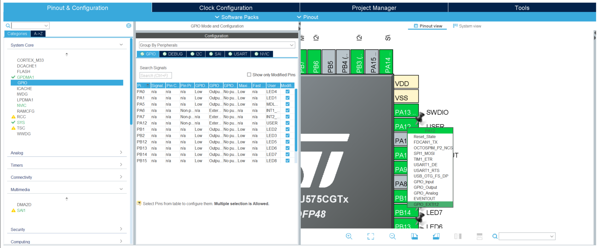

 
Şimdi de GPIO ayarları yapılacaktır. GPIO ayarında öncelikle kesmeler ayarlanır. Şekilde gözüktüğü gibi pine sol tıklanır ve GPIO_EXTIx seçilir. Kesme pininin ismini değiştirmek için sağ tıklayarak Enter User Label seçilerek ismi değiştirilebilir. Kesmeler konusunda dikkat edilmesi gereken nokta kesme kanallarının çakışmaması gerektiğidir. PA1 pini ile PB1 pini aynı anda kesme kanalı olarak seçilememektedir.

Kesme pinleri aşağıdaki gibidir:
<li> ISM330ISN Birinci Kesme Pini -> PA6
<li> ISM330ISN İkinci Kesme Pini  -> PA7
<li> User Button Pini             -> PA12

Sensörlerin kesme pinlerini ve mikrodenetleyicinin hangi pinlerine bağlandıklarını kartın şematiği üzerinden de görebilirsiniz. Şematiğe aşağıdan ulaşabilirsiniz:

[Şematik](https://empa.com)
 

  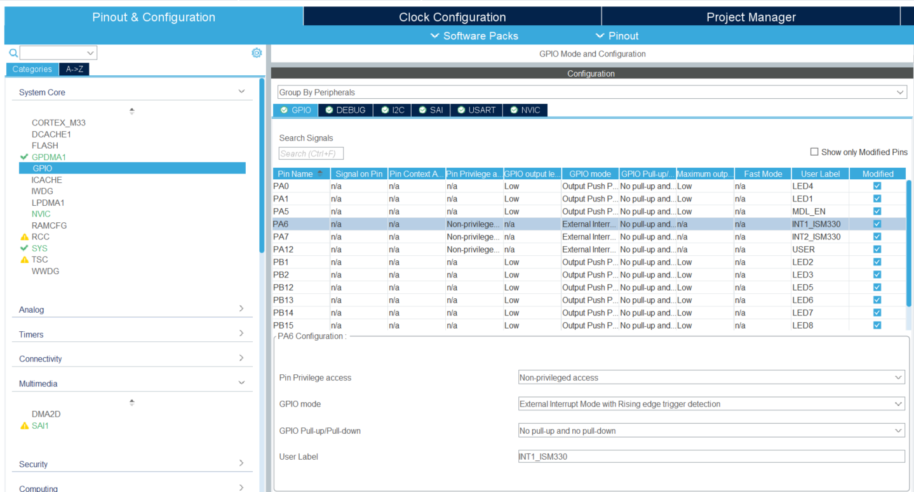

 

İsimlendirmelerini tamamladığımız kesme pinlerinin yükselen kenar ya da düşen kenarda olacağını şekilde görüldüğü üzere System Core->GPIO altında her bir kesme pinine tıklayarak GPIO mode seçeneğinden  seçilebilir. Buton kesmesi şekilde görüldüğü üzere External Interrupt Mode with Falling edge trigger detection olarak seçilmiştir. Bu sayede düşen kenarda kesmeleri algılayabiliriz.

 
 

  

 

Kesmeleri ayarladıktan sonra harici kesme kanallarının aktif hale getirmek gerekir. Şekilde gözüktüğü üzere System Core->GPIO kısmında NVIC sekmesine tıklanır ve kesme hatlarının yanındaki Enabled kutucukları işaretlenir.

  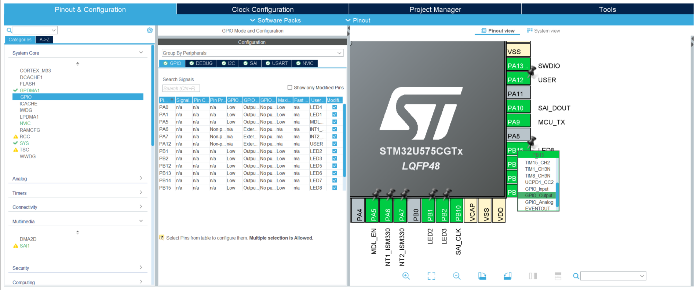

 

 Pinout view kısmında bir pin direkt olarak çıkış olarak kullanıcaksa (led vs.) şekildeki gibi pine sol tıklanır. Ardından o pine bir isim verilmek istenirse sağ tıklayarak Enter User Label seçilerek pinin ismi değiştirilebilir.

  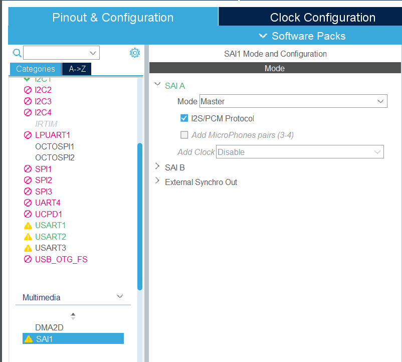

 

IMP34DT05 (mikrofon sensörü)'den veri alabilmek için SAI (Serial Audio Interface) kullanılmıştır. SAI arayüzünü aktif hale getirmek için Multimedia altında SAI1 seçeneği seçilmelidir. Ardından 
Mode altında SAIA seçeneğinin altında Mode olarak Master seçilmeli ve I2S/PCM Protocol kutucuğu tiklenmelidir.

  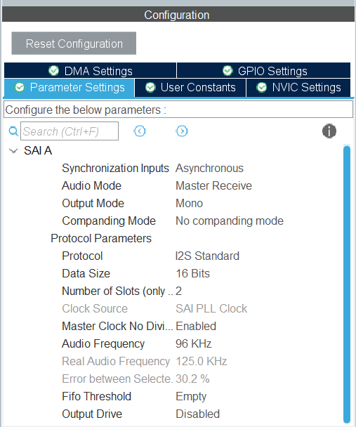

 

 Configuration altında Parameter Settings sekmesinde Audio Mode olarak Master Receive, Output Mode olarak Mono, Audio Frequency olarak 96Khz seçilmiştir.

  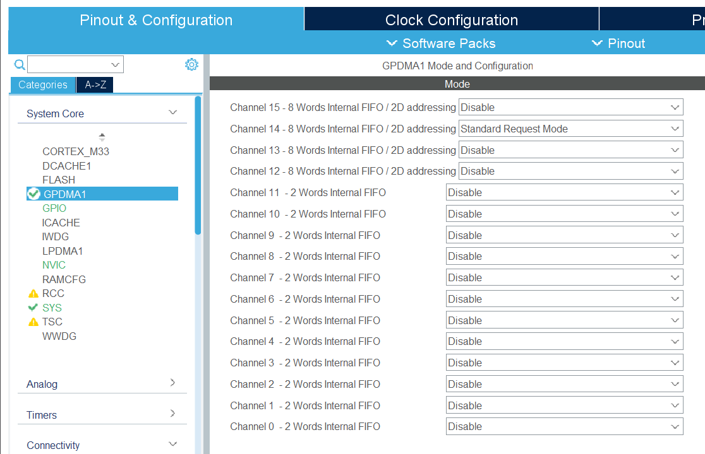

 

 Ardından SAI arayüzünden veriyi alırken DMA (Direct Memory Access) kullanılmıştır. SAI1 için DMA Settings sekmesine tıklandığında SAI1 için DMA isteklerinin GPDMA1'de yapıldığı belirtilmektedir. System Core->GPDMA1 sekmesi altında Mode kısmında Channel 14 - 8 Words Internal FIFO / 2D addressing seçeneğinde Standart Request Mode seçilmiştir. 

 

  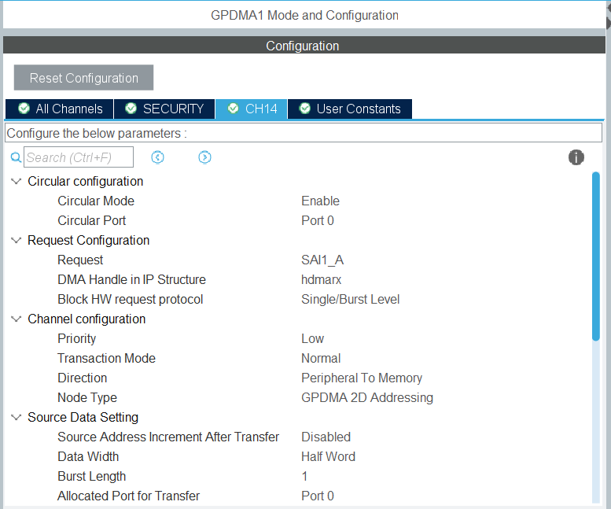

 

GPDMA1->Configuration altında CH14 sekmesinde Circular Mode Enable olarak seçilir. Request seçeneği SAI1_A olarak seçilir. Direction ise Peripheral to Memory şeklinde seçilir. Source Data Setting ve Destination Data Setting kısmında Data Width, Half Word olarak seçilecektir. Destination Data Setting kısmında Destination Address Increment After Transfer, Enabled olarak seçilir. Ve böylece SAI için gerekli ayarlar tamamlanmış olur.

 
 

  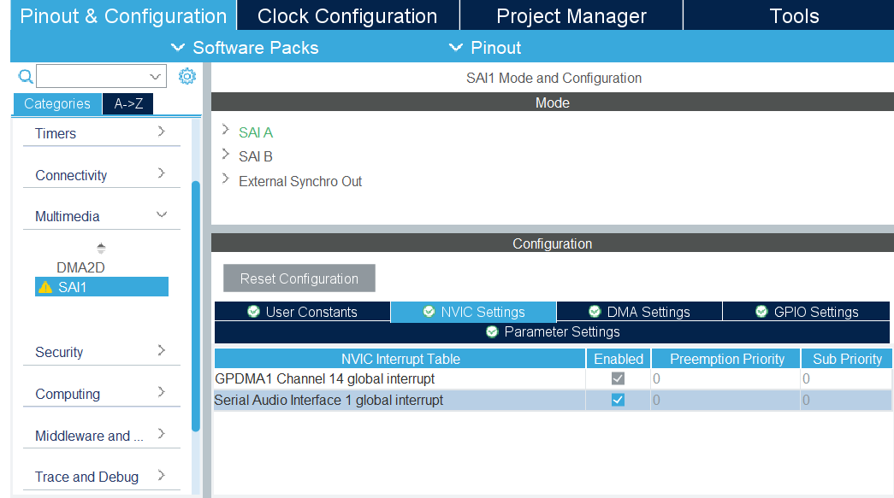

 

Ardında SAI için kesmenin etkin hale getirilmesi gereklidir. Multimedia -> SAI1 -> Configuration altında NVIC Settings sekmesi içerinde Serial Audio Interface 1 Global Interrupt yanındaki Enabled kutucuğunun işaretlenmesi gereklidir.

  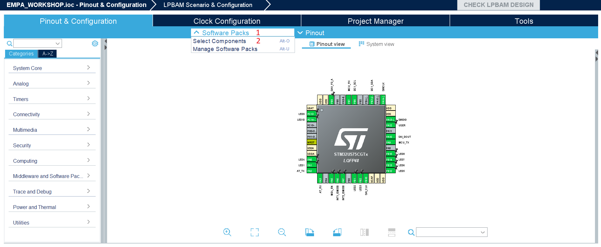

 

Yüklenmiş olan ISPU paketinin kod içerisine aktarılması için şekildeki Software Packs (1) altında Select Components (2) seçilir.

  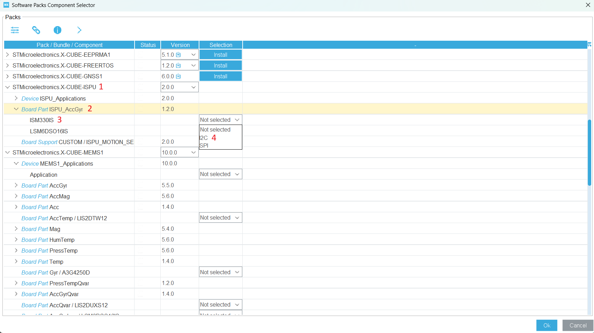

 

Açılmış olan Software Packs Component Selector sekmesinde STMicroelectronics.X-CUBE-ISPU (1) versiyonu 2.0.0 olarak seçilir. Board Part ISPU_AccGyr (2) altında ISM330IS (3) yanındaki kutucukta I2C (4) seçilir ve Ok tuşuna basılır.

  

 

Ardından .ioc uzantılı CubeMX dosyası içerisinde Middleware and Software Packs-> X-CUBE-ISPU seçilir. Mode altında Board Part ISPU AccGyr kutucuğu tiklenir. 

  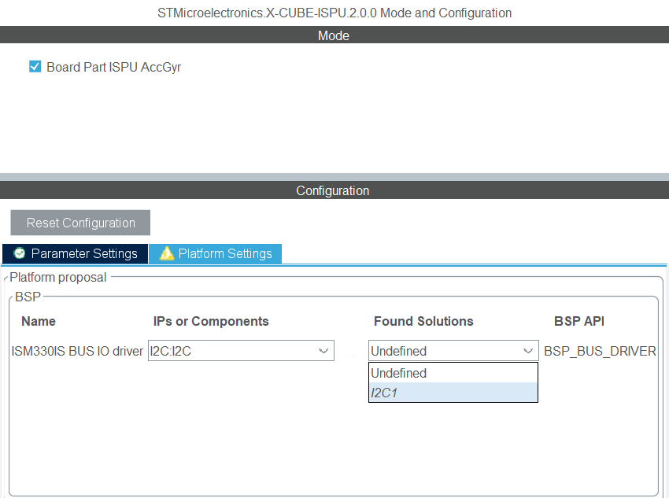

 

Ardından Configuration altında Platform Settings sekmesine tıklanır. Found Solutions sekmesinde projemizde kullanmış olduğumuz I2C1 seçilir. Ve ISM330IS için software package ekleme işlemi tamamlanmış olur.

